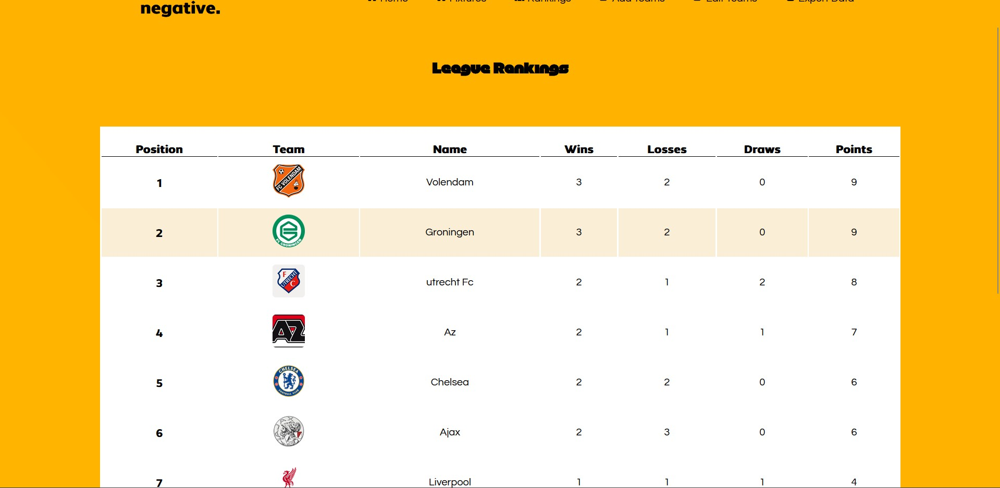

# Mijn Progress

## Week 1:

- Ik heb het repository aangemaakt.
- Ik heb ook een thema gekozen: **LEAGUE SIMULATOR**.

## Mijn plannen voor deze week:

- De homepage afmaken.
- Een paar animaties toevoegen.

## Problemen die ik ben tegengekomen:

- Geen problemen.

## Alles ging goed, omdat ik dit eerder heb geleerd.

## Week 2

- Ik ben bezig met het fixtures deel waar teams moeten tegen elkaar spelen.
## Problemen die ik tegen aan loop
- teams kunnen niet tegen elkaar spelen
- functies werken niet zo goed
- relaties tussen tabelen in de database zijn moelijk en te ingewikkeld.

##  Mijn probleem nu 

## Uitleg van het probleem
- De applicatie slaagt er niet in om de wedstrijden voor de huidige week weer te geven, met de boodschap "Geen wedstrijden beschikbaar voor deze week." die op de webpagina verschijnt. Dit probleem doet zich voor, ondanks dat de code geschreven is om wedstrijden voor de opgegeven week te genereren.

## hoe moet het eruit zien
- Heel simpel het array() moet niet leeg zijn en je ziet wel teams moeten tegen elkaar spelen

## Probleem gefixed
- Probleem is nu gefixed . Fixtures zijn nu zichtbaar maar er zijn nu andere problemen

## Wat heb ik geleerd 
- ik moest een andere functie toevoegen 
- ik moet mijn code goed begrijppen en zelf alles checken voor de zekerheid.
- Met chat gpt werkt alles sneller maar als je je code niet goed begrijp , heb je een grote probleem

## Probleemen die ik nu tegen aan loopt 
- Teams spelen tegen elkaar bij elke week dat is niet zo . Elke week moet een team tegen een andere team spelen.

## Week 3

- Het tonnen van fixtures , simuleren van resultaten en oplsaan van resultaten.

## Problemen die ik tegen aan liep
 - Teams spelen tegen elkaar bij elke week dat is niet zo . Elke week moet een team tegen een andere team spelen. bjv 
 ajax speelt met groningen in week 1 , in week 2 moet ajax tegen feyenoord
 - het opslaan knop werkt niet goed.
 - de pagina word vernieuwd als je de simulate knop drukt.
 - wedstjden worden niet opgeslagen , dus als je xampp opnieuw openen, krijg je een nieuwe resultaat bij een wedstrijd.

## Problemen gefixed 
- Simuleren knop en opslaan knop werken goed.
- Wedstrijden resultaten zijn nu opgeslagen.
- Teams spelen niet meer tegen elkaar als ze al samen tegen elkaar hebben gespeeld. 
- resultaaten blijven staan als je xampp weer open doet. 

## Oplossingen
- Sessie starten 
- Nieuwe functies toegevoegd.

## proef 

Resultaten zijn nu opgeslagen

- Alles zijn nu goed. dit is het tabel. Elke team heeft een ID. Dus ze spelen tegen elkaar en je ziet ook dat
als een team tegen een andere team op een week speelt , gaan ze niet meer op een andere week tegen elkaar spelen.

## WEEK 4

- Een ranking systeem toevoegen . 

## Problemen die ik tegen aan liep
- Ik kwam tegen geen probleem omdat ik dit al eerder heb gedaan.

## proef

